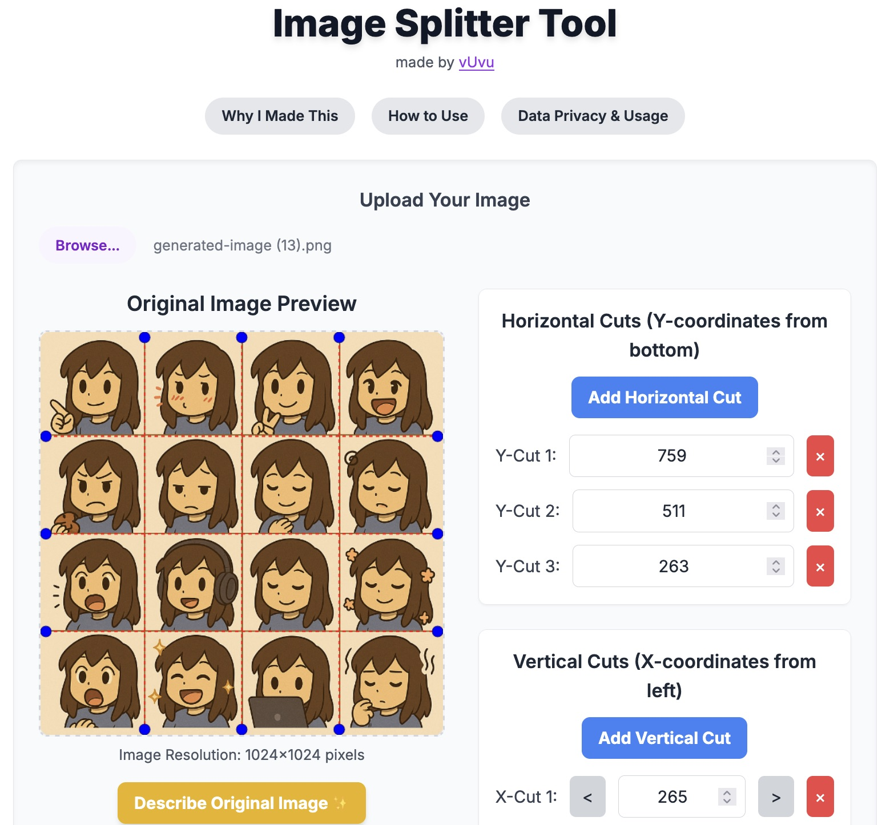
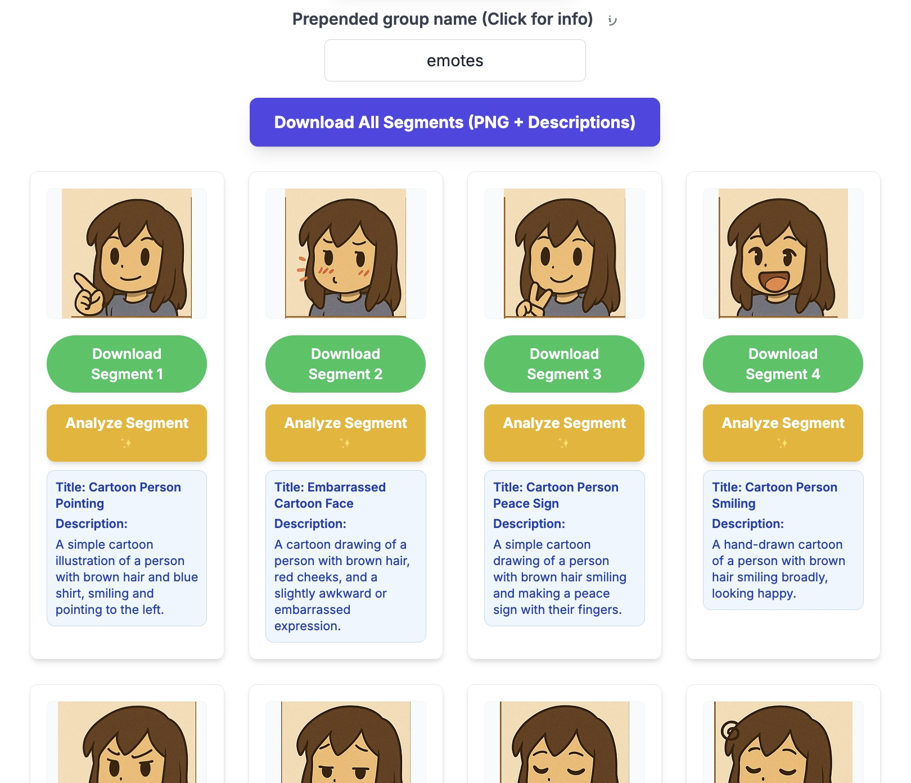

# [Image Splitter Tool](https://github.com/vuvuvu/image-splitter-tool)

[Gemini](https://g.co/gemini/share/735bed2a3d02) hosts this app and is free to use with a google account.


This is a browser-based utility built with React and Tailwind CSS that allows users to upload an image, define precise horizontal and vertical cut lines, and extract the resulting segments. It is especially useful for splitting AI-generated images (e.g., sticker sheets, character sets, or asset packs) that may not align perfectly to a grid.

The tool also integrates with the [Google Gemini AI](https://g.co/gemini/share/735bed2a3d02) to optionally generate descriptive titles and summaries for both the original image and each individual segment, making it easy to organize and catalog your assets.

 
https://github.com/vuvuvu/image-splitter-tool/ai-descriptions.jpeg


## What it Does

-   **Client-Side Processing:** Your images are processed directly in your browser. Nothing is uploaded to a server, ensuring your privacy.
-   **Visual Cutting:** Add horizontal and vertical cut lines that are overlaid on your image, giving you a clear preview of the final segments.
-   **Precise Adjustments:** Fine-tune the position of each cut line by typing in exact pixel values or using stepper buttons for single-pixel adjustments.
-   **AI-Powered Descriptions:** With the click of a button, send the original image or individual segments to the Google Gemini API to get a detailed description or a concise title and summary.
-   **Batch Downloading:** Download all extracted image segments as individual PNG files. If you've generated descriptions, a neatly formatted `.txt` file containing all the titles and descriptions is also downloaded.
-   **Easy Organization:** An optional "group name" can be prepended to all downloaded files, helping you keep your assets organized.

## Key Features

-   **Upload Any Image:** Works with standard image formats like PNG, JPG, and GIF.
-   **Dynamic Cut Points:** Add or remove cut lines on the fly. The tool automatically preserves manually adjusted positions even as new automatic lines are added.
-   **Responsive Preview:** The image preview and cut lines are displayed in a responsive canvas that fits your screen.
-   **AI Analysis:**
    -   Describe the entire original image.
    -   Analyze individual segments for a title and description.
    -   Analyze all segments in a single batch operation.
-   **Data Privacy:** Image data is only sent to Google's API when you explicitly click an "Analyze" or "Describe" button. The core image splitting functionality is 100% local.

## [How to Use](https://g.co/gemini/share/735bed2a3d02)

[Gemini](https://g.co/gemini/share/735bed2a3d02) hosts this app and is free to use with a google account. 

1.  **Upload Image:** Click the **"Upload Your Image"** button and select an image file from your computer. A preview of the image will appear.

2.  **Add Cut Lines:**
    -   Click **"Add Horizontal Cut"** or **"Add Vertical Cut"**. This will add evenly spaced cut lines to the image. Clicking again will add more divisions (e.g., from halves to thirds, then fourths, etc.).
    -   Red dashed lines representing the cuts will appear on the image preview.

3.  **Adjust Cuts:**
    -   For each cut line, a control will appear on the right.
    -   You can directly type a pixel value into the input box. For horizontal cuts, the `Y` coordinate is measured in pixels from the **bottom** of the image. For vertical cuts, the `X` coordinate is measured from the **left**.
    -   Use the **`<`** and **`>`** buttons to adjust the pixel value up or down for fine-tuning.
    -   Click the **`×`** button to remove a specific cut line.

4.  **Extract Segments:**
    -   Once you are satisfied with the cut lines, click the **"Extract Segments"** button.
    -   A new section will appear below, displaying all the individual image segments that were created.

5.  **Analyze (Optional):**
    -   To get a description of your original image, click **"Describe Original Image ✨"**.
    -   Below each extracted segment, you can click **"Analyze Segment ✨"** to get a title and description for just that part.
    -   To analyze all segments at once, click the **"Analyze All Segments ✨"** button.

6.  **Download:**
    -   (Optional) Enter a name in the **"Prepended group name"** field to add a prefix to your downloaded files (e.g., `MyEmotes_segment_1.png`).
    -   Click **"Download All Segments"**. This will download each segment as a separate `.png` file and, if you generated any descriptions, a single `.txt` file containing all of them.
    -   You can also download segments one by one using the "Download Segment" button under each preview.

## Setup and Local Development

To run this project on your local machine, you will need Node.js and npm (or yarn).

1.  **Clone the repository:**
    ```sh
    git clone https://github.com/vuvuvu/image-splitter-tool.git
    cd image-splitter-tool
    ```

2.  **Install dependencies:**
    ```sh
    npm install
    # or
    yarn install
    ```

3.  **Get a Google Gemini API Key:**
    -   The AI features require a Google Gemini API key. You can get one from the [Google AI Studio](https://aistudio.google.com/app/apikey). Or click the google 
    -   Open the `image-splitter-tool.txt` (or the corresponding `.js` or `.jsx` file in your project).
    -   Find the `apiKey` constant inside the `handleDescribeOriginalImage` and `handleAnalyzeSegment` functions.
    -   Replace the empty string (`""`) with your actual Gemini API key.

    ```javascript
    // Example in handleDescribeOriginalImage function
    const apiKey = "YOUR_API_KEY_HERE"; // <-- PASTE YOUR KEY HERE
    const apiUrl = `https://generativelanguage.googleapis.com/v1beta/models/gemini-2.0-flash:generateContent?key=${apiKey}`;
    ```

4.  **Run the application (if using Create React App):**
    ```sh
    npm start
    # or
    yarn start
    ```
    The application will open in your default browser, typically at `http://localhost:3000`.

## Technology Stack

-   **Frontend:** [React](https://reactjs.org/)
-   **Styling:** [Tailwind CSS](https://tailwindcss.com/)
-   **AI Integration:** [Google Gemini API](https://ai.google.dev/)
-   **File Downloads:** [FileSaver.js](https://github.com/eligrey/FileSaver.js/)
